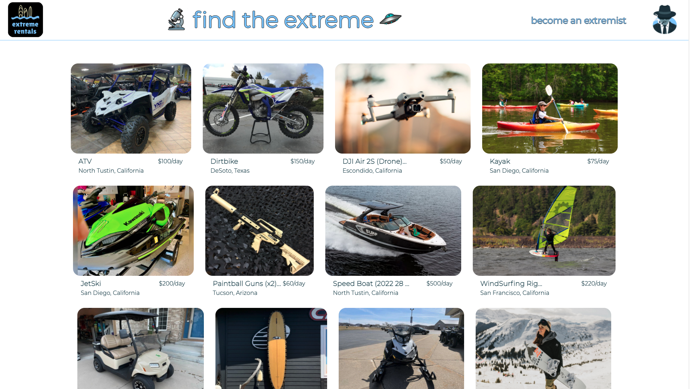
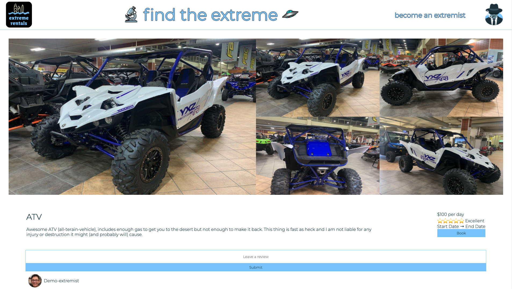
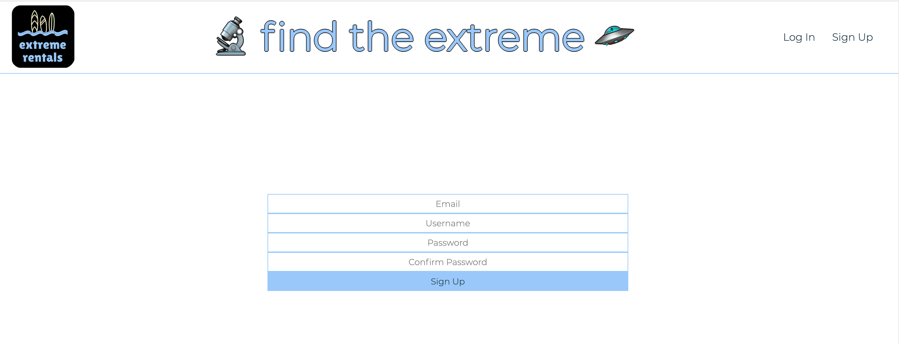
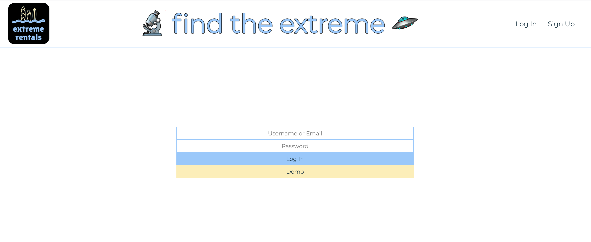
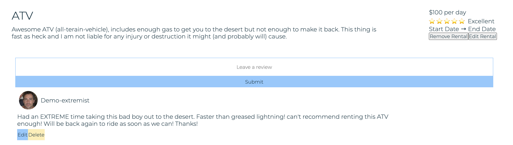

<p align='center'>
  
</p>

# Extreme Rentals
Extreme Rentals is a full stack application inspired by Airbnb created with Express/Sequelize for the backend and React/Redux for the frontend. It features an extensive user authentication process and provides a platform for users to post and review extreme things to rent. 

* View <a href='https://unwined-wine-app.herokuapp.com/'>Extreme Rentals</a> Live

* Reference to the Extreme Rentals <a href='https://github.com/caseytuer/extreme-rentals/wiki'>Wiki Docs</a>

| Table of Contents |
| ----------------- |
| 1. [Features](#features) |
| 2. [Installation](#installation) |
| 3. [Technical Implementation Details](#technical-implementation-details) |
| 4. [Future Features](#future-features) |
| 5. [Contact](#contact) |
| 6. [Special Thanks](#special-thanks) |

## Technologies
* <a href="https://developer.mozilla.org/en-US/docs/Web/JavaScript"></a>
* <a href="https://www.postgresql.org/"></a>
* <a href="https://sequelize.org/"></a>
* <a href="https://www.npmjs.com/package/express"></a>
* <a href="https://nodejs.org/"></a>
* <a href="https://reactjs.org/"></a>
* <a href="https://redux.js.org/"></a>
* <a href="https://developer.mozilla.org/en-US/docs/Web/CSS"></a>

## Features

### Home Page
Discover and search for new rentals


### Rental Page
Rental Images, description, price, etc.


### Sign In and Sign Up



### Reviews
Users can add, edit, and delete reviews



## Installation
To build/run project locally, please follow these steps:

1. Clone this repository

```javascript
git clone https://github.com/caseytuer/extreme-rentals.git
```

2. Install npm dependencies for both the `/frontend` and `/backend`

```javascript
npm install
```

3. In the `/backend` directory, create a `.env` based on the `.env.example` with proper settings
4. Setup your PostgreSQL user, password and database and ensure it matches your `.env` file
5. Run migrations and seeds in the `/backend`

```javascript
npx dotenv sequelize db:create
npx dotenv sequelize db:migrate
npx dotenv sequelize db:seed:all
```

6. Start both the backend and frontend

```javascript
npm start
```

